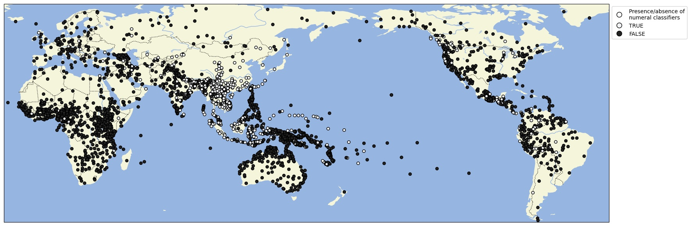

# World Atlas of Classifier Languages

## How to cite

If you use these data please cite

- the original source
    Her, One-Soon Her, Harald Hammarström and Marc Allassonnière-Tang. 2022. Defining numeral classifiers and identifying classifier languages of the world. Linguistics Vanguard. (Available online at https://wacl.clld.org)

- this dataset using the DOI of the [particular released version](../../releases/) you were using

## Description

This dataset is licensed under a CC-BY-4.0 license

Available online at https://wacl.clld.org

## CLDF Datasets

The following CLDF datasets are available in [cldf](cldf):

- CLDF [StructureDataset](https://github.com/cldf/cldf/tree/master/modules/StructureDataset) at [cldf/StructureDataset-metadata.json](cldf/StructureDataset-metadata.json)
